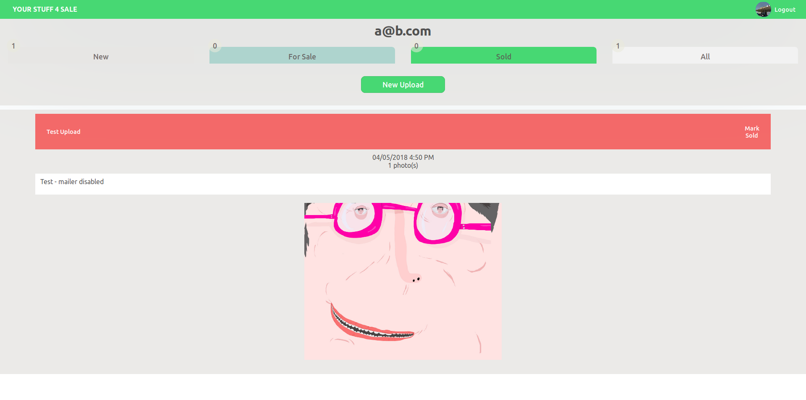
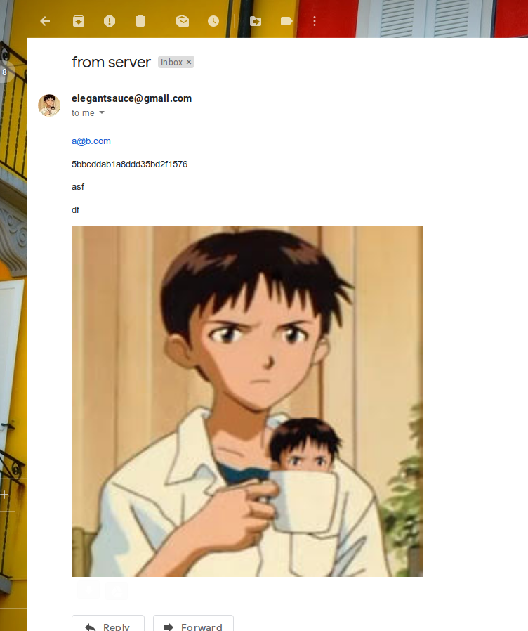

# yourstuff4sale

~~Demo hosted by AWS at [13.57.5.153](http://13.57.5.153/) - hardcoded admin page "credentials" = github@demo.pleasebenice~~
Oops, previously removed ec2 instance! Will soon be re-configured & hosted @ [ys4s.elegantsauce.xyz](http://ys4s.elegantsauce.xyz)

Web solution created for communicating between physical shops/local sellers and the team at yourstuff4sale.com
  - Organizes "New", "Posted" and "Sold" listings
  - Sends email backup, communications for each transitional User/Admin action
  - semi-RESTful user and upload APIs
  - React front-end with Node.js (Express) back-end
  - json web tokens saved to localStorage for persitant, encrypted login
  - multer file uploader - canvas.toBlob() polyfill used to reduce image size/quality

Utility made (voluntarily and as a demo) on spec provided by -  [yourstuf4sale.com](https://www.yourstuff4sale.com)

Please do not post to their site without first contacting them or me.

 Thank you thank you.